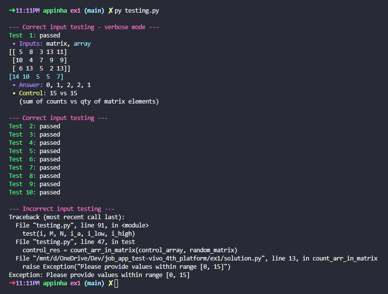

# Exercise 1

*Code an algorithm that counts how many times each element in a given array occurs in a given matrix.*

## Subject

> "Uma imagem bitmap pode ser representada como uma matriz de dimensões M x N, em que cada posição da matriz pode assumir um valor inteiro dentro de um intervalo. Construa um algoritmo que receba como entrada um Vetor A[N]em que An ∈ { 0, 1, 2,..., 15 }. A saída do seu algoritmo deve ser uma String indicando a quantidade de vezes que cada An foi encontrado na matriz de bitmap. No caso em que algum elemento não tenha sido encontrado, o algoritmo deve retornar que a quantidade é zero para aquele elemento. O formato da String é livre."

## Contents

* [solution.py](solution.py) - source code developed to solve the exercice.
* [testing.py](testing.py) - testing code developed to test the solution.
* [requirements.txt](requirements.txt) - list of all necessary packages to run the application.

## Usage

### Requirements

This code is intended for use in **Linux** based systems with `python3` installed.

Required packages for running the code are listed in [requirements.txt](requirements.txt).

### Instructions

#### Using the function

After cloning this repository and copying `solution.py` into your code directory, follow the instructions bellow.

**1. Import `solution.py` into your code:**
```
from solution import count_arr_in_matrix
```

**2. Call `count_arr_in_matrix()` giving a 1D ndarray\* and a 2D ndarray\* as input arguments:**
```
res = count_arr_in_matrix(array, matrix)
```
> *\* ndarray: a numpy array instance, which can be instantiated (created) like:*
```
arr_1d = np.array([1, 2, 3, 4, 5])
arr_2d = np.array([1, 2, 3, 4, 5], [5, 4, 3, 2, 1])
```

#### Testing

After cloning this repository, `cd` to `ex1` directory and follow the instructions bellow.

**1. For testing, run:**
```
$ python3 testing.py
```
> ***Note:** the test output will be printed on stdout (see image below)*



**2. To change testing parameters, open `testing.py` and modify values of variables as indicated in the file.**