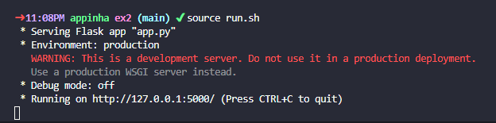

# Exercise 2

## Subject

	"Transforme o algoritmo anterior em uma API Rest. Você receberá como
	parâmetro uma lista com os valores de An e deverá retornar a saída do
	algoritmo no formato JSON."

## Contents

* [activate.sh](activate.sh) - shell script to set and/or activate the virtual environment.
* [run.sh](run.sh) - shell script to run the application.
* [app.py](app.py) - application's source code.
* [list.json](list.json) - JSON file to be used as input in the application.
* [post.sh](post.sh) - shell script to POST `list.json` to the application.
* [requirements.txt](requirements.txt) - list of all necessary packages to run the application.

## Usage

### Requirements

This application is intended for use in **Linux** based systems with `python3` installed.

All packages listed in [requirements.txt](requirements.txt) will be installed upon running the application as instructed below.

### Instructions

After cloning this repository, `cd` to `ex2` directory and follow the instructions bellow.

**1. To set and/or activate the virtual environment, run:**
```
$ source activate.sh
```
*Note: if the virtual environment is not yet set, you'll be prompted to install/update `python3-venv` and a `venv` directory will be created.*

**2. Once inside `venv`, to start the application, run:**
```
(venv) $ source run.sh
```
*Note: when running the virtual environment for the first time, you'll be prompted to install all necessary packages to run the application.*



**3. Edit the list values (inside square brackets) in `list.json` as you like.**
```
{
	"list": [1, 2, 3]
}
```
*Note: the application only accepts values within the range 0 <= value <= 15.*

**4. To input this list to the application, in another shell window, run:**
```
$ sh post.sh
```


**5. To kill the application, press `ctrl+C`.**

**6. To deactivate the virtual environment, run:**
```
(venv) $ deactivate
```
