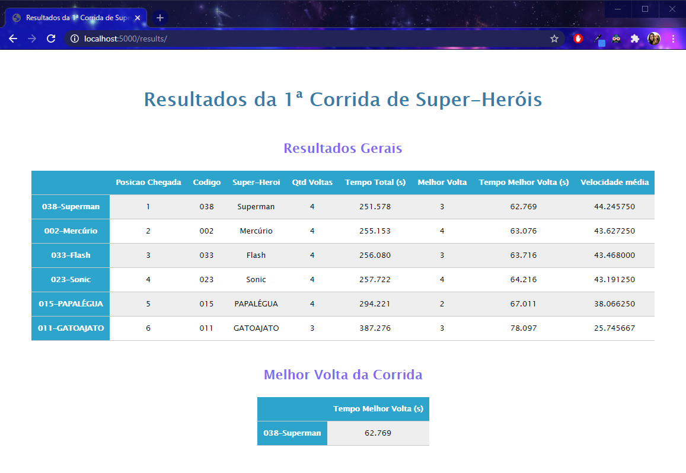

# Exercise 3

## Subject

	"Dado o seguinte log da primeira corrida de Super-Heróis – Volta ao Mundo.

	(arquivo corrida.log)

	Desenvolva uma API que leia o arquivo de log acima e retorne as seguintes
	informações:
	Posição de Chegada, Código do Super-herói, Nome Super-herói, Quantidade de
	Voltas Completadas e Tempo Total de Prova.

	**Observações**
	• A primeira linha do arquivo pode ser desconsiderada (Cabeçalho).
	• A corrida termina quando o primeiro colocado completa 4 voltas.

	**Bônus**
	1. Descobrir a melhor volta de cada super-herói.
	2. Descobrir a melhor volta da corrida.
	3. Calcular a velocidade média de cada super-herói durante toda a corrida."

## Contents

* [activate.sh](activate.sh) - shell script to set and/or activate the virtual environment.
* [run.sh](run.sh) - shell script to run the application.
* [app.py](app.py) - application's source code.
* [corrida.log](corrida.log) - log file to be used as input in the application.
* [post.sh](post.sh) - shell script to POST `corrida.log` to the application.
* [requirements.txt](requirements.txt) - list of all necessary packages to run the application.

## Usage

### Requirements

This application is intended for use in **Linux** based systems with `python3` installed.

All packages listed in [requirements.txt](requirements.txt) will be installed upon running the application as instructed below.

### Instructions

After cloning this repository, `cd` to `ex3` directory and follow the instructions bellow.

**1. To set and/or activate the virtual environment, run:**
```
$ source activate.sh
```
*Note: if the virtual environment is not yet set, you'll be prompted to install/update `python3-venv` and a `venv` directory will be created.*

**2. Once inside `venv`, to start the application, run:**
```
(venv) $ source run.sh
```
*Note: when running the virtual environment for the first time, you'll be prompted to install all necessary packages to run the application.*


**3. To input the log file to the application, in another shell window, run:**
```
$ sh post.sh
```


**4. To see the application's result on a web browser, access `http://localhost:5000/`**



**4. To kill the application, press `ctrl+C`.**

**5. To deactivate the virtual environment, run:**
```
(venv) $ deactivate
```

